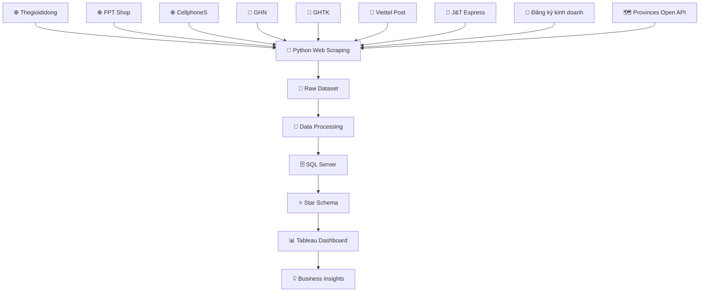

# Đồ Án Tốt Nghiệp: Phân Tích Ngành Điện Tử Việt Nam
Chào mừng bạn đến với kho lưu trữ mã nguồn của dự án Phân tích Ngành Điện tử Việt Nam.

Đây là đồ án tốt nghiệp xây dựng một hệ thống Data Engineering hoàn chỉnh, ứng dụng quy trình ELT (Extract – Load – Transform) để tự động thu thập, xử lý, lưu trữ và trực quan hóa dữ liệu ngành điện tử Việt Nam.

Hệ thống sử dụng Python để thu thập dữ liệu từ nhiều website thương mại điện tử, doanh nghiệp và dịch vụ logistics; sau đó làm sạch, chuẩn hóa dữ liệu, xây dựng Data Warehouse trên SQL Server theo mô hình Star Schema, cuối cùng trực quan hóa bằng Tableau Dashboard nhằm hỗ trợ phân tích và ra quyết định.
# Tổng Quan Dự Án
Thu thập dữ liệu ngành điện tử Việt Nam từ nhiều nguồn.
Tự động hóa quá trình xử lý dữ liệu.
Xây dựng Data Warehouse phục vụ Business Intelligence.
Phân tích xu hướng thị trường điện tử Việt Nam.
Trực quan hóa dữ liệu bằng Tableau.
# 🌐 Nguồn dữ liệu
Hệ thống tự động thu thập dữ liệu bằng Python Web Scraping và REST API từ các nguồn sau.

Thiết bị điện tử
https://www.thegioididong.com/dtdd
https://fptshop.com.vn/may-tinh-xach-tay
https://cellphones.com.vn/mobile.html
Dịch vụ vận chuyển
https://ghn.vn/
https://ghtk.vn/
https://viettelpost.com.vn/
https://jtexpress.vn/vi
Dữ liệu doanh nghiệp
https://dangkykinhdoanh.gov.vn/vn/Pages/Trangchu.aspx
Dữ liệu hành chính
https://provinces.open-api.vn/api/v2/
# 🏗️ Kiến trúc hệ thống

# 🚀 Quy trình ELT
## 1. Extract

Hệ thống sử dụng Python để:

Thu thập dữ liệu tự động từ các website.
Gọi API lấy dữ liệu hành chính.
Chuẩn hóa dữ liệu đầu vào.
Lưu dữ liệu thô.
## 2. Load

Sau khi thu thập:

Dữ liệu được nạp vào SQL Server.
Lưu vào Staging Database.
Tối ưu tốc độ nạp bằng Batch Insert và fast_executemany.
## 3. Transform

Thực hiện:

Kiểm tra chất lượng dữ liệu.
Loại bỏ dữ liệu trùng.
Xử lý giá trị thiếu.
Chuẩn hóa tên sản phẩm.
Chuẩn hóa tỉnh/thành phố.
Chuẩn hóa kiểu dữ liệu.
Chuẩn hóa đơn vị tiền tệ.

Sau đó dữ liệu được đưa vào Data Warehouse theo mô hình Star Schema.

# ⭐ Data Warehouse
Fact Table
FactElectronics
Dimension Tables
DimProduct
DimCategory
DimLocation
DimTime
DimCompany
# 📊 Tableau Dashboard

Sau khi hoàn thành Data Warehouse, Tableau được sử dụng để xây dựng Dashboard gồm:

Dashboard tổng quan ngành điện tử Việt Nam
Dashboard doanh thu
Dashboard giá bán
Dashboard sản phẩm
Dashboard thương hiệu
Dashboard địa phương
Dashboard logistics
Dashboard xu hướng theo thời gian
Tableau Story
# 🛠 Công nghệ sử dụng
Ngôn ngữ
Python 3.10+
Web Scraping
Requests
BeautifulSoup4
Selenium
Xử lý dữ liệu
Pandas
NumPy
Database
SQL Server
SQLAlchemy
PyODBC
Data Warehouse
Star Schema
Visualization
Tableau Desktop
# 📂 Cấu trúc thư mục
```text
Vietnam-Electronics-Analytics/
│
├── data/
│   ├── raw/                     # Dữ liệu thu thập từ Web Scraping và API
│   ├── processed/               # Dữ liệu sau khi làm sạch và chuẩn hóa
│   ├── output/                  # Dữ liệu đầu ra phục vụ phân tích
│   └── backup/                  # Dữ liệu sao lưu (nếu có)
│
├── docs/
│   ├── images/                  # Hình ảnh README, Dashboard
│   ├── diagrams/                # Sơ đồ kiến trúc hệ thống
│   └── report/                  # Tài liệu đồ án
│
├── notebooks/                   # Notebook phục vụ khám phá dữ liệu (EDA)
│
├── sql/
│   ├── staging/                 # Script tạo Staging Database
│   ├── warehouse/               # Script Star Schema
│   ├── procedures/              # Stored Procedures
│   └── views/                   # SQL Views
│
├── src/
│   ├── extract/                 # Web Scraping & API Integration
│   ├── transform/               # Data Validation, Cleaning, Transformation
│   ├── load/                    # Load dữ liệu vào SQL Server
│   ├── warehouse/               # Xây dựng Data Warehouse
│   ├── utils/                   # Hàm tiện ích
│   └── main.py                  # Điểm khởi chạy chương trình
│
├── tableau/
│   ├── dashboard.twbx           # Tableau Workbook
│   └── screenshots/             # Ảnh Dashboard
│
├── requirements.txt             # Danh sách thư viện Python
├── .env.example                 # Mẫu cấu hình môi trường
├── .gitignore
├── LICENSE
└── README.md
```
# ⚙️ Hướng dẫn cài đặt
Clone Project
git clone <repository-url>

cd DATN
Tạo Virtual Environment

Windows

python -m venv .venv

.venv\Scripts\activate

Linux/macOS

python3 -m venv .venv

source .venv/bin/activate
Cài đặt thư viện
pip install -r requirements.txt
Cấu hình môi trường
DB_SERVER=YOUR_SERVER

DB_NAME=ElectronicsDW

DB_USER=sa

DB_PASS=YOUR_PASSWORD
▶️ Chạy hệ thống
python -m src.main

Hoặc chỉ chạy bước thu thập dữ liệu

python -m src.scraper
# ✨ Chức năng nổi bật
Web Scraping tự động
API Integration
Data Validation
Data Cleaning
Data Transformation
SQL Server Integration
Data Warehouse
Star Schema
Tableau Dashboard
Tableau Story
Business Intelligence
# 📈 Kết quả đạt được
Tự động hóa quá trình thu thập dữ liệu.
Chuẩn hóa dữ liệu ngành điện tử Việt Nam.
Xây dựng Data Warehouse phục vụ phân tích.
Dashboard trực quan trên Tableau.
Hỗ trợ phân tích xu hướng thị trường điện tử Việt Nam.
