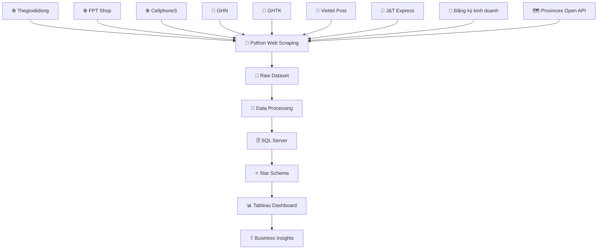

# Đồ Án Tốt Nghiệp: Phân Tích Ngành Điện Tử Việt Nam
Chào mừng bạn đến với kho lưu trữ mã nguồn của dự án Phân tích Ngành Điện tử Việt Nam.

Đây là đồ án tốt nghiệp xây dựng một hệ thống Data Engineering hoàn chỉnh, ứng dụng quy trình ELT (Extract – Load – Transform) để tự động thu thập, xử lý, lưu trữ và trực quan hóa dữ liệu ngành điện tử Việt Nam.

Hệ thống sử dụng Python để thu thập dữ liệu từ nhiều website thương mại điện tử, doanh nghiệp và dịch vụ logistics; sau đó làm sạch, chuẩn hóa dữ liệu, xây dựng Data Warehouse trên SQL Server theo mô hình Star Schema, cuối cùng trực quan hóa bằng Tableau Dashboard nhằm hỗ trợ phân tích và ra quyết định.
# Tổng Quan Dự Án
Thu thập dữ liệu ngành điện tử Việt Nam từ nhiều nguồn.
Tự động hóa quá trình xử lý dữ liệu.
Xây dựng Data Warehouse phục vụ Business Intelligence.
Phân tích xu hướng thị trường điện tử Việt Nam.
Trực quan hóa dữ liệu bằng Tableau.
# 🌐 Nguồn dữ liệu
Hệ thống tự động thu thập dữ liệu bằng Python Web Scraping và REST API từ các nguồn sau.

Thiết bị điện tử
https://www.thegioididong.com/dtdd
https://fptshop.com.vn/may-tinh-xach-tay
https://cellphones.com.vn/mobile.html
Dịch vụ vận chuyển
https://ghn.vn/
https://ghtk.vn/
https://viettelpost.com.vn/
https://jtexpress.vn/vi
Dữ liệu doanh nghiệp
https://dangkykinhdoanh.gov.vn/vn/Pages/Trangchu.aspx
Dữ liệu hành chính
https://provinces.open-api.vn/api/v2/
# 🏗️ Kiến trúc hệ thống

# 🚀 Quy trình ELT
## 1. Extract

Hệ thống sử dụng Python để:

Thu thập dữ liệu tự động từ các website.
Gọi API lấy dữ liệu hành chính.
Chuẩn hóa dữ liệu đầu vào.
Lưu dữ liệu thô.
## 2. Load

Sau khi thu thập:

Dữ liệu được nạp vào SQL Server.
Lưu vào Staging Database.
Tối ưu tốc độ nạp bằng Batch Insert và fast_executemany.
## 3. Transform

Thực hiện:

Kiểm tra chất lượng dữ liệu.
Loại bỏ dữ liệu trùng.
Xử lý giá trị thiếu.
Chuẩn hóa tên sản phẩm.
Chuẩn hóa tỉnh/thành phố.
Chuẩn hóa kiểu dữ liệu.
Chuẩn hóa đơn vị tiền tệ.

Sau đó dữ liệu được đưa vào Data Warehouse theo mô hình Star Schema.

# ⭐ Data Warehouse
Fact Table
FactElectronics
Dimension Tables
DimProduct
DimCategory
DimLocation
DimTime
DimCompany
# 📊 Tableau Dashboard

Sau khi hoàn thành Data Warehouse, Tableau được sử dụng để xây dựng Dashboard gồm:

Dashboard tổng quan ngành điện tử Việt Nam
Dashboard doanh thu
Dashboard giá bán
Dashboard sản phẩm
Dashboard thương hiệu
Dashboard địa phương
Dashboard logistics
Dashboard xu hướng theo thời gian
Tableau Story
# 🛠 Công nghệ sử dụng
Ngôn ngữ
Python 3.10+
Web Scraping
Requests
BeautifulSoup4
Selenium
Xử lý dữ liệu
Pandas
NumPy
Database
SQL Server
SQLAlchemy
PyODBC
Data Warehouse
Star Schema
Visualization
Tableau Desktop
# 📂 Cấu trúc thư mục
```text
PhanTich-DienTu-VietNam/
│
├── data/
│   ├── raw/                     # File CSV thu thập từ Web Scraping
│   ├── cleaned/                 # File Excel sau khi làm sạch dữ liệu
│   ├── transformed/             # Dữ liệu sau khi chuẩn hóa
│   └── output/                  # Dữ liệu cuối cùng để nạp vào SQL Server
│
├── docs/
│   ├── images/                  # Hình ảnh Dashboard & README
│   ├── diagrams/                # Sơ đồ hệ thống
│   └── report/                  # Báo cáo đồ án
│
├── sql/
│   ├── staging/                 # Script tạo bảng Staging
│   ├── warehouse/               # Script Star Schema
│   └── procedures/              # Stored Procedures
│
├── src/
│   ├── scraper/                 # Python Web Scraping
│   ├── loader/                  # Nạp dữ liệu vào SQL Server
│   ├── warehouse/               # Xây dựng Data Warehouse
│   ├── utils/                   # Hàm hỗ trợ
│   └── main.py                  # Chương trình chính
│
├── tableau/
│   ├── dashboard.twbx           # Tableau Workbook
│   └── screenshots/             # Ảnh Dashboard
│
├── requirements.txt
├── .gitignore
└── README.md
```
# ⚙️ Hướng Dẫn Cài Đặt

## 1. Sao chép dự án

```bash
git clone https://github.com/your-username/Vietnam-Electronics-Analytics.git

cd Vietnam-Electronics-Analytics
```

## 2. Tạo môi trường ảo (Virtual Environment)

### Windows

```bash
python -m venv .venv

.venv\Scripts\activate
```

### Linux / macOS

```bash
python3 -m venv .venv

source .venv/bin/activate
```

## 3. Cài đặt thư viện

```bash
pip install -r requirements.txt
```

## 4. Cấu hình môi trường

Tạo file `.env` tại thư mục gốc của dự án và khai báo thông tin kết nối SQL Server.

```text
DB_SERVER=YOUR_SERVER
DB_NAME=ElectronicsDW
DB_USER=sa
DB_PASS=YOUR_PASSWORD
```

---

# ▶️ Quy Trình Thực Hiện

### Bước 1. Thu thập dữ liệu

Chạy chương trình Python để tự động thu thập dữ liệu từ các website thương mại điện tử, dịch vụ vận chuyển và API.

```bash
python -m src.scraper
```

Dữ liệu sau khi thu thập sẽ được lưu tại:

```text
data/raw/
```

---

### Bước 2. Làm sạch và chuẩn hóa dữ liệu

Tiến hành kiểm tra và xử lý dữ liệu bằng **Microsoft Excel**, bao gồm:

- Loại bỏ dữ liệu trùng lặp.
- Xử lý dữ liệu bị thiếu.
- Chuẩn hóa tên sản phẩm, thương hiệu và địa phương.
- Chuẩn hóa định dạng ngày tháng và đơn vị dữ liệu.
- Chuyển đổi dữ liệu sang định dạng phục vụ phân tích.

Dữ liệu sau khi xử lý được lưu tại:

```text
data/cleaned/
```

---

### Bước 3. Nạp dữ liệu vào SQL Server

Sau khi dữ liệu được làm sạch, tiến hành nạp dữ liệu vào SQL Server để chuẩn bị xây dựng Kho dữ liệu (Data Warehouse).

---

### Bước 4. Xây dựng Data Warehouse

Thực hiện các Script SQL để xây dựng mô hình **Star Schema**, bao gồm:

- FactElectronics
- DimProduct
- DimCategory
- DimCompany
- DimLocation
- DimTime

---

### Bước 5. Trực quan hóa dữ liệu

Kết nối Tableau Desktop với SQL Server để xây dựng các Dashboard và Story phục vụ phân tích dữ liệu.

---

# ✨ Chức Năng Nổi Bật

- 🌐 Thu thập dữ liệu tự động bằng Python Web Scraping.
- 🔗 Kết nối và khai thác dữ liệu từ REST API.
- ✔ Kiểm tra và đánh giá chất lượng dữ liệu.
- 🧹 Làm sạch và chuẩn hóa dữ liệu.
- 🔄 Chuyển đổi dữ liệu phục vụ phân tích.
- 📄 Xuất dữ liệu dưới định dạng CSV và Excel.
- 🗄 Tích hợp với SQL Server.
- ⭐ Xây dựng Kho dữ liệu theo mô hình Star Schema.
- 📊 Xây dựng Dashboard trực quan bằng Tableau.
- 📖 Thiết kế Tableau Story phục vụ phân tích.
- 📈 Hỗ trợ phân tích dữ liệu và ra quyết định.

---

# 📈 Kết Quả Đạt Được

Sau khi triển khai, hệ thống đạt được các kết quả sau:

- Tự động thu thập dữ liệu từ nhiều nguồn trực tuyến.
- Chuẩn hóa và làm sạch dữ liệu trước khi lưu trữ.
- Xây dựng Kho dữ liệu (Data Warehouse) trên SQL Server.
- Thiết kế mô hình Star Schema phục vụ phân tích.
- Xây dựng Dashboard trực quan bằng Tableau.
- Phân tích xu hướng phát triển của ngành điện tử Việt Nam.
- Hỗ trợ khai thác dữ liệu và cung cấp thông tin phục vụ Business Intelligence.

---
