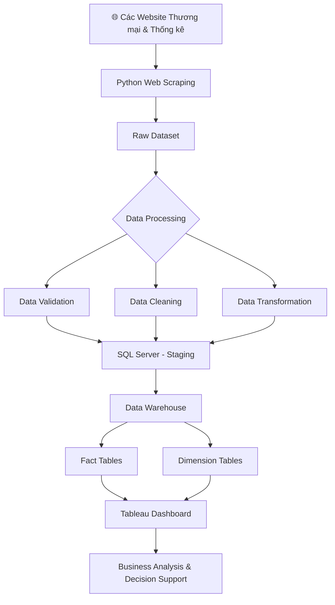

# Đồ Án Tốt Nghiệp: Phân Tích Ngành Điện Tử Việt Nam
Chào mừng bạn đến với kho lưu trữ mã nguồn của dự án Phân tích Ngành Điện tử Việt Nam. Đây là đồ án tốt nghiệp thiết kế và xây dựng một quy trình ELT (Extract – Load – Transform) nhằm thu thập, tích hợp, làm sạch và chuẩn hóa dữ liệu về ngành điện tử Việt Nam, đồng thời xây dựng Kho dữ liệu (Data Warehouse) phục vụ phân tích dữ liệu và trực quan hóa bằng Tableau.
# Tổng Quan Dự Án
Dự án giải quyết bài toán xử lý dữ liệu ngành điện tử Việt Nam từ nhiều nguồn dữ liệu (CSV, Excel hoặc dữ liệu thống kê công khai), thực hiện kiểm soát chất lượng dữ liệu (Data Quality) thông qua các bộ quy tắc nghiệp vụ được cấu hình sẵn, tự động phát hiện và xử lý dữ liệu lỗi (Data Healing), sau đó nạp dữ liệu vào SQL Server Data Warehouse theo mô hình Star Schema.

Kho dữ liệu sau khi hoàn thiện được kết nối với Tableau Desktop để xây dựng Dashboard và Story trực quan, hỗ trợ phân tích xu hướng phát triển ngành điện tử Việt Nam, giúp doanh nghiệp và nhà quản lý dễ dàng khai thác dữ liệu phục vụ ra quyết định.
# Các Giai Đoạn & Tính Năng Cốt Lõi
Hệ thống được tổ chức theo quy trình ELT (Extract – Load – Transform).

# 1. Extract (Trích Xuất & Kiểm Tra Dữ Liệu)
Tự động đọc dữ liệu từ các tệp CSV/Excel trong thư mục data/raw/.
Kiểm tra chất lượng dữ liệu bằng Data Quality Validator.
Phát hiện dữ liệu thiếu, sai định dạng, trùng lặp hoặc vi phạm quy tắc nghiệp vụ.
Xuất báo cáo chất lượng dữ liệu tại:
docs/03_notes/engineering/data_issues.txt
# 2. Transform (Biến Đổi & Chuẩn Hóa)
Data Healing (Làm sạch dữ liệu)

Hệ thống tự động:

Xử lý dữ liệu bị thiếu bằng giá trị trung bình hoặc trung vị theo từng nhóm dữ liệu.
Chuẩn hóa tên tỉnh/thành phố.
Chuẩn hóa tên nhóm sản phẩm điện tử.
Chuẩn hóa định dạng ngày tháng.
Chuẩn hóa đơn vị tính và giá trị tiền tệ.
Loại bỏ dữ liệu trùng lặp.
Chuẩn hóa kiểu dữ liệu phục vụ Data Warehouse.
Data Segregation (Phân loại dữ liệu)

Sau khi xử lý, dữ liệu được chia thành:

PASS
Dữ liệu hợp lệ.
WARNING
Dữ liệu đã được tự động sửa lỗi.
CRITICAL
Các bản ghi sai nghiêm trọng (ví dụ: giá trị âm, thiếu khóa chính, sai năm thống kê...) được tách riêng để phục vụ kiểm tra.

Các dữ liệu đầu ra được lưu tại:

data/output/
# 3. Load (Nạp Dữ Liệu Vào Kho Dữ Liệu)

Dữ liệu sạch được nạp vào bảng Staging trong SQL Server với tốc độ tối ưu thông qua fast_executemany.

Sau đó hệ thống tự động thực thi Stored Procedure:

sp_load_star_schema

để phân bổ dữ liệu sang mô hình Star Schema.

Fact Table
FactElectronics
Dimension Tables
DimTime
DimLocation
DimProduct
DimCategory
DimCompany

Kho dữ liệu được tối ưu hóa nhằm tăng hiệu năng truy vấn, giúp Tableau khai thác dữ liệu nhanh chóng và hiệu quả.
# Phân Tích & Trực Quan Hóa Dữ Liệu Bằng Tableau

Sau khi dữ liệu được nạp vào Data Warehouse, hệ thống kết nối trực tiếp với Tableau Desktop để xây dựng các Dashboard và Story phục vụ phân tích.

Các Dashboard bao gồm:

Dashboard tổng quan ngành điện tử Việt Nam.
Phân tích kim ngạch xuất khẩu theo thời gian.
Phân tích kim ngạch nhập khẩu theo thời gian.
So sánh các nhóm sản phẩm điện tử.
Phân tích theo quốc gia đối tác.
Phân tích theo khu vực và địa phương.
Top sản phẩm có giá trị xuất khẩu cao.
Dashboard KPI tổng hợp.
Tableau Story trình bày xu hướng phát triển của ngành điện tử Việt Nam qua các năm.
