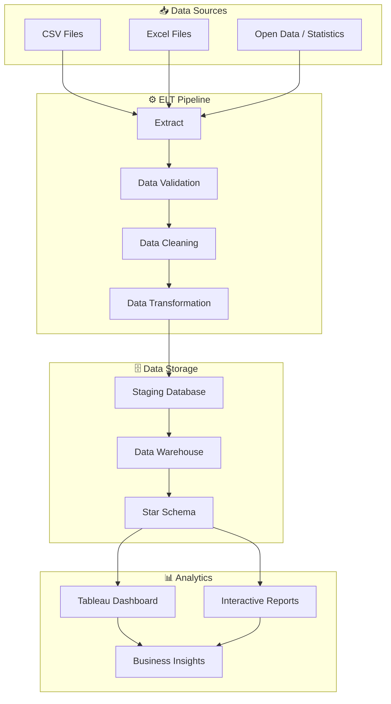

# Đồ Án Tốt Nghiệp: Phân Tích Ngành Điện Tử Việt Nam
Chào mừng bạn đến với kho lưu trữ mã nguồn của dự án Phân tích Ngành Điện tử Việt Nam. Đây là đồ án tốt nghiệp thiết kế và xây dựng một quy trình ELT (Extract – Load – Transform) nhằm thu thập, tích hợp, làm sạch và chuẩn hóa dữ liệu về ngành điện tử Việt Nam, đồng thời xây dựng Kho dữ liệu (Data Warehouse) phục vụ phân tích dữ liệu và trực quan hóa bằng Tableau.
# Tổng Quan Dự Án
Dự án giải quyết bài toán xử lý dữ liệu ngành điện tử Việt Nam từ nhiều nguồn dữ liệu (CSV, Excel hoặc dữ liệu thống kê công khai), thực hiện kiểm soát chất lượng dữ liệu (Data Quality) thông qua các bộ quy tắc nghiệp vụ được cấu hình sẵn, tự động phát hiện và xử lý dữ liệu lỗi (Data Healing), sau đó nạp dữ liệu vào SQL Server Data Warehouse theo mô hình Star Schema.

Kho dữ liệu sau khi hoàn thiện được kết nối với Tableau Desktop để xây dựng Dashboard và Story trực quan, hỗ trợ phân tích xu hướng phát triển ngành điện tử Việt Nam, giúp doanh nghiệp và nhà quản lý dễ dàng khai thác dữ liệu phục vụ ra quyết định.
# Các Giai Đoạn & Tính Năng Cốt Lõi
Hệ thống được tổ chức theo quy trình ELT (Extract – Load – Transform).

# Cấu trúc dự án

```text
Du_An_Tot_Nghiep/
│
├── data/
│   ├── raw/          <- Dữ liệu gốc, không chỉnh sửa
│   ├── interim/      <- Dữ liệu trung gian đã qua xử lý
│   ├── processed/    <- Dữ liệu cuối cùng dùng để modeling
│   └── external/     <- Dữ liệu từ nguồn bên ngoài
│
├── notebooks/        <- Jupyter notebooks
├── models/           <- Model đã train
│
├── reports/
│   └── figures/      <- Biểu đồ, hình ảnh báo cáo
│
├── docs/             <- Tài liệu dự án
├── references/       <- Tài liệu tham khảo
│
├── du_an_tot_nghiep/
│   ├── config.py
│   ├── dataset.py
│   ├── features.py
│   ├── plots.py
│   │
│   └── modeling/
│       ├── train.py
│       └── predict.py
│
├── requirements.txt
└── pyproject.toml
```
